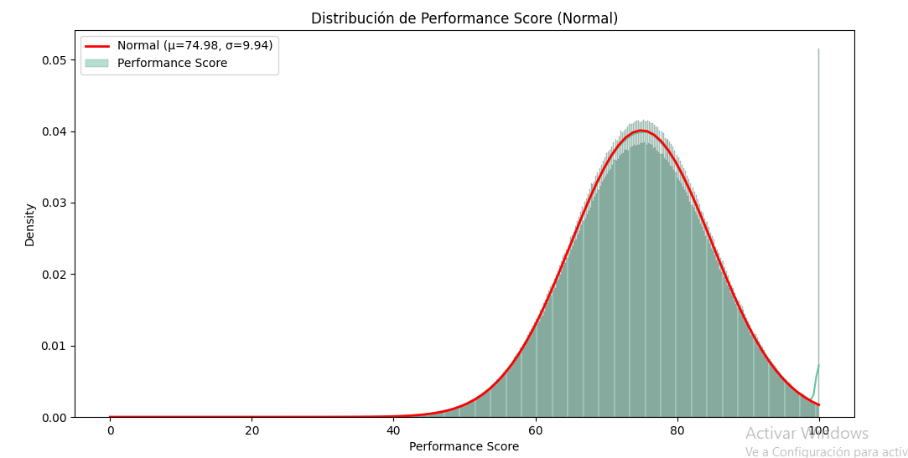
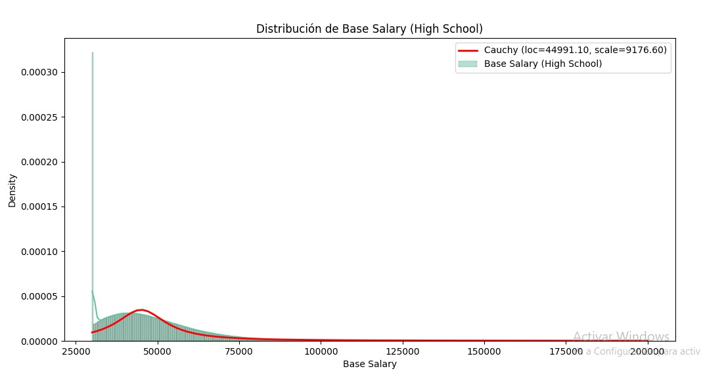
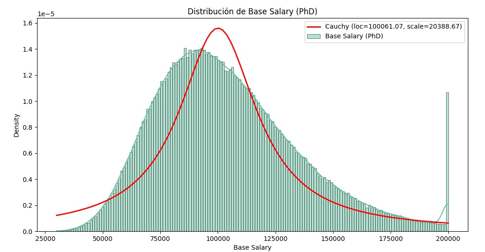
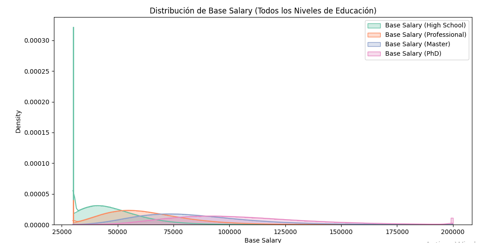

# Employee Data Generator Project

**University:** Escuela Colombiana de Ingeniería Julio Garavito  
**Student:** Sebastian Cardona Parra  
**Professor:** Rafael Niquefa  
**Course:** Algorithms and Data Visualization  
**Date:** April 10, 2025

## Objective

The objective of this project is to generate a synthetic dataset simulating employee information for a company, designed to reflect real-world patterns and characteristics. This data is intended for data analysis and visualization, allowing students and professionals to explore trends, distributions, and relationships between variables in a controlled and realistic environment. The project includes generating a CSV file with coherent data, unit tests to ensure quality, and visualizations showcasing the statistical properties of the generated data.

## Project Description

The project consists of three main components:

1. **Data Generation (`employee_data_generator.py`):** A Python script that uses the `Faker` library and statistical distributions to create realistic employee data.
2. **Data Visualization (`visualize_employee_data.py`):** A script that generates plots to analyze the distributions and relationships of the generated variables.
3. **Unit Tests (`test_employee_data_generator.py`):** A suite of tests ensuring the correctness and consistency of the generated data.

The resulting file, `employee_data.csv`, contains detailed employee information such as identification, salary, education, performance, location, and more, with logical relationships between columns to emulate real-world scenarios.

## Methodology

### Data Generation

The data is generated using the `employee_data_generator.py` script, which employs the following techniques:

- **Faker Library:** Generates realistic names, addresses, emails, phone numbers, SSNs, and other personal data, using the "en_US" locale for consistency.
- **Statistical Distributions:**
  - **Cauchy:** Used for base salaries, with parameters adjusted by education level (High School: loc=45,000, scale=10,000; Professional: loc=60,000, scale=12,000; Master: loc=80,000, scale=15,000; PhD: loc=100,000, scale=20,000). Values are clipped between 30,000 and 200,000.
  - **Normal:** Applied to performance scores (mean=75, std=10, clipped between 0 and 100) and bonus percentages (mean=5, std=2, clipped between 0 and 15). Also used for state selection, with a centered distribution to simulate population density.
  - **Poisson:** Models vacation days (lambda=15) and sick days (lambda=5).
  - **"Cake" Distribution:** A custom distribution for gender, assigning probabilities of 45% male, 45% female, and 10% other, reflecting an inclusive representation.
  - **Custom Categorical:** Defined probabilities for education (20% High School, 50% Professional, 25% Master, 5% PhD), employee status (85% Active, 10% Inactive, 5% Leave), work location (50% Office, 30% Remote, 20% Hybrid), and shift (60% Day, 30% Night, 10% Flexible).
- **Logical Relationships:**
  - Job titles are tied to specific departments (e.g., "Software Developer" only in "IT").
  - Employee levels (Entry, Mid, Senior) are determined by days of service (<365 days: Entry, 365-730 days: Mid, >730 days: Senior).
  - Last review dates are set after hire dates and, if hired over a year ago, are capped before one year ago.
  - Emails are generated as `first.last@company.com`.
  - Cities are linked to specific states (e.g., "Los Angeles" only in "CA").
  - Days of service are calculated as the difference between the current date and the hire date, ensuring logical consistency.
- **Automation:** The script allows specifying the number of rows and automatically generates a CSV file.

### Data Structure

The `employee_data.csv` file contains the following columns, designed to reflect a human resources management system:

| Column                | Description                                                                | Data Type          | Relationships/Notes                                                              |
|-----------------------|----------------------------------------------------------------------------|--------------------|---------------------------------------------------------------------------------|
| `employee_id`         | Unique identifier (EMP + 6 digits)                                          | String             | Unique for each employee                                                        |
| `first_name`          | Employee's first name                                                      | String             | Based on gender (M, F, Other)                                                   |
| `last_name`           | Employee's last name                                                       | String             | Randomly generated                                                              |
| `email`               | Email address (first.last@company.com)                                     | String             | Derived from `first_name` and `last_name`                                       |
| `phone_number`        | Phone number                                                               | String             | US format                                                                       |
| `department`          | Department (IT, HHRR, Finance, etc.)                                       | String             | Defines options for `job_title`                                                 |
| `job_title`           | Job title                                                                  | String             | Consistent with `department`                                                    |
| `hire_date`           | Hire date (last 5 years)                                                   | Date               | Determines `days_service` and limits `last_review_date`                         |
| `days_service`        | Days since hire                                                            | Integer            | Calculated as (today - `hire_date`). Defines `employee_level`                   |
| `base_salary`         | Base salary (USD)                                                          | Float              | Based on `education` (Cauchy). Clipped between 30,000 and 200,000               |
| `bonus_percentage`    | Bonus percentage                                                           | Float              | Normal (mean=5, std=2). Clipped between 0 and 15                                |
| `status`              | Employee status (Active, Inactive, Leave)                                  | String             | Probabilities: 85% Active, 10% Inactive, 5% Leave                               |
| `birth_date`          | Date of birth (18-65 years)                                                | Date               | Ensures working-age employees                                                   |
| `address`             | Street address                                                             | String             | Randomly generated                                                              |
| `city`                | City                                                                       | String             | Linked to `state`                                                               |
| `state`               | State (CA, NY, TX, etc.)                                                   | String             | Selected with normal distribution                                               |
| `zip_code`            | Zip code                                                                   | String             | US format                                                                       |
| `country`             | Country (fixed: USA)                                                       | String             | Constant for all                                                                |
| `gender`              | Gender (M, F, Other)                                                       | String             | "Cake" distribution: 45% M, 45% F, 10% Other                                    |
| `education`           | Education level (High School, Professional, Master, PhD)                   | String             | Influences `base_salary`. Probabilities: 20%, 50%, 25%, 5%                      |
| `performance_score`   | Performance score (0-100)                                                  | Float              | Normal (mean=75, std=10)                                                       |
| `last_review_date`    | Last review date                                                           | Date               | After `hire_date`, limited by seniority                                         |
| `employee_level`      | Employee level (Entry, Mid, Senior)                                        | String             | Based on `days_service`                                                         |
| `vacation_days`       | Accumulated vacation days                                                  | Integer            | Poisson (lambda=15)                                                             |
| `sick_days`           | Sick days taken                                                            | Integer            | Poisson (lambda=5)                                                              |
| `work_location`       | Work location (Office, Remote, Hybrid)                                     | String             | Probabilities: 50% Office, 30% Remote, 20% Hybrid                               |
| `shift`               | Shift (Day, Night, Flexible)                                               | String             | Probabilities: 60% Day, 30% Night, 10% Flexible                                 |
| `emergency_contact`   | Emergency contact number                                                   | String             | US format                                                                       |
| `ssn`                 | Social Security Number                                                     | String             | US format (unique)                                                              |
| `bank_account`        | Bank account number

### Key Relationships

- **Education and Salary:** Base salaries reflect education levels, with higher means for advanced degrees (PhD > Master > Professional > High School).
- **Seniority and Level:** Days of service determine employee level, impacting analyses of experience.
- **Department and Title:** Job titles are restricted to corresponding departments, ensuring coherence.
- **Location:** States and cities are linked, with states selected via a normal distribution to simulate higher density in certain areas.
- **Dates:** Hire date, review date, and days of service are interrelated to maintain temporal consistency.

### Statistical Distributions

The distributions used reflect patterns observed in real data:

- **"Cake" Distribution (Gender):**  
  The custom gender distribution assigns equal probabilities to male and female (45% each) and 10% to "Other," promoting diversity.  
  
  
  
  
  
  

- **Normal Distribution:**
  - **Performance Score:** Centered at 75 with a standard deviation of 10, clipped between 0 and 100, simulating employee evaluations where most perform above average.  
    
  - **Bonus Percentage:** Centered at 5% with a standard deviation of 2%, clipped between 0 and 15%, reflecting moderate bonuses with realistic variability. 
  


- **Poisson Distribution:**
  - **Vacation Days:** With lambda=15, models typical annual vacation accrual.  
    
  - **Sick Days:** With lambda=5, reflects sporadic use of sick leave.  
    

- **Cauchy Distribution (Salaries):**  
Base salaries use Cauchy to capture a heavy-tailed distribution, reflecting salary variability by education. Parameters vary by education level, and values are clipped to avoid unrealistic extremes.  







### Data Visualization

The `employee_data_analysis.py` script generates plots to explore the data:

- **Histograms with KDE:** Display distributions of salaries, performance scores, bonuses, vacation days, and sick days, overlaying theoretical distributions (Cauchy, Normal, Poisson).
- **Pie Charts:** Represent the distribution of categorical variables like gender, education, employee level, status, work location, and shift.
- **Combined Plot:** Compares base salaries across education levels in a single histogram.

These visualizations validate that the generated data matches the specified distributions and enable exploration of relationships, such as the impact of education on salary.

### Test Coverage

The `test_employee_data_generator.py` file includes unit tests covering 94% of the code in `employee_data_generator.py`. The tests verify:

- Correct initialization of the generator.
- Uniqueness and format of `employee_id`.
- Salary consistency with Cauchy distribution and bounds.
- State-city relationship.
- Data types and value ranges.
- Employee level and review date logic.
- Department-job title consistency.
- Email format.
- Statistical properties of distributions (approximate means and standard deviations).
- Edge cases (generation with a single row).


### Real-World Relevance

The data is designed to emulate a real human resources system:

- **Demographics:** Names, genders, and birth dates reflect a diverse U.S. workforce.
- **Geography:** State and city selection, with a normal distribution, simulates concentration in urban areas.
- **Organizational Structure:** Departments and job titles cover common roles in modern companies (IT, HHRR, Finance, etc.).
- **Compensation:** Salaries vary by education, reflecting labor market trends. Bonuses and performance scores align with corporate evaluation patterns.
- **Time and Experience:** Seniority determines employee level, and review dates ensure a logical history.
- **Benefits and Absences:** Vacation and sick days are consistent with standard labor policies.

These elements enable realistic analyses, such as correlations between education and salary, geographic distribution of employees, or the impact of seniority on performance.

### Creating the CSV File

To generate the `employee_data.csv` file, follow these steps:

1. Ensure dependencies are installed:
   ```bash
   pip install pandas numpy faker scipy

2. Run the data generation script:
   ```bash
   python employee_data_generator.py 10000000
   ```
   This generates employee_data.csv with 10000000 rows.

3. Open the CSV file in a spreadsheet application or use Python to analyze it.

### Conclusions
This project demonstrates the ability to generate synthetic data reflecting real-world patterns, useful for teaching and practicing data visualization. The statistical distributions used (Cauchy, Normal, Poisson, and "Cake") ensure variability and realism, while logical relationships between columns (e.g., education-salary, seniority-level) enable complex analyses. Unit tests guarantee quality and reliability, with 90% code coverage. The generated visualizations validate statistical properties and facilitate data exploration.

The project is scalable and adaptable, allowing modifications to distributions or columns as needed. Its modular design (generation, testing, visualization) makes it ideal for educational or professional settings. In the context of the Data Visualization course, this work provides a strong foundation for analyzing trends, identifying patterns, and practicing data presentation techniques.

### Instructions to Run the Project

1. Clone the repository from GitHub.
2. Install the listed dependencies.
3. Generate data with employee_data_generator.py.
4. Visualize results with visualize_employee_data.py.
5. Run tests with coverage run -m unittest test/test_employee_data_generator.py
6. See coverage report with coverage report -m.

